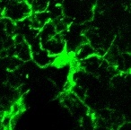
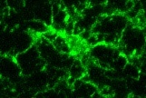
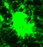
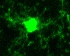

# Microglia Morphology Recognition
It is the Morphology Recognition of Microglia Slices Images, including the `ResNet` and the `VGGNet` implementation in PyTorch version.  

### Dataset
The dataset is collected by ourselves rigorously in the laboratory. The morphologyof the microglia recorded in the laboratory includes `dystrophic`, `hyper-ramified`, `hypertrophic` and `ramified`, as the following chart illustrates. 

    
    
    
    

|Morphology| Number of Samples |
|-|-|
| Dystrophic| 301 |
| Hyper-Ramified| 1463 |
| Hypertrophic | 987 |
| Ramified| 1855 |  

In the further experiment, the models are used for testing the performance of recognizing the benign and malignant thyroid nodules in ultrasound images.  
  
### ResNet
The pretrained models `ResNet18`, `ResNet34`, `ResNet50`, `ResNet101` and `ResNet152` in PyTorch version are provided. And all the configurations you need to set are inside the only file `resnet_testing.ipynb`. The network is implemented in PyTorch version. Make sure you have installed PyTorch and the other necessary packages. Moreover, the [trained network](https://pan.baidu.com/s/1_9hiJjxThksPpj2UM9kSqA?pwd=1989) of the microglia dataset is available.  

### VGGNet
The pretrained models `vgg11`, `vgg11_bn`, `vgg13`, `vgg13_bn`, `vgg16`, `vgg16_bn`, `vgg19` and `vgg19_bn` in PyTorch version are provided in the `model.py`. In the experiment, the `vgg16` model had the best performance, and was set as the default model, and the [trained network](https://pan.baidu.com/s/1pKlTUayJNggimTqOOCt4oA?pwd=1989) is available.   
To perform the training process, you just need to execute the file `train.py`, and the file `predict.py` for the testing process. Moreover, the classes in the recognition task should be typed into the file `class_indices.json`. 

### Result
In this experiment, 80% of the dataset is chosen randomly for the training process, and the rest for the validation and testing process. Since the dataset is unbalanced, the performance may have discrimination. 
|Model| Correct Rate in Testing Set |
|-|-|
| ResNet50 | 92.16% |
| VGG16 | 88.63% |

